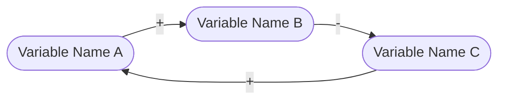
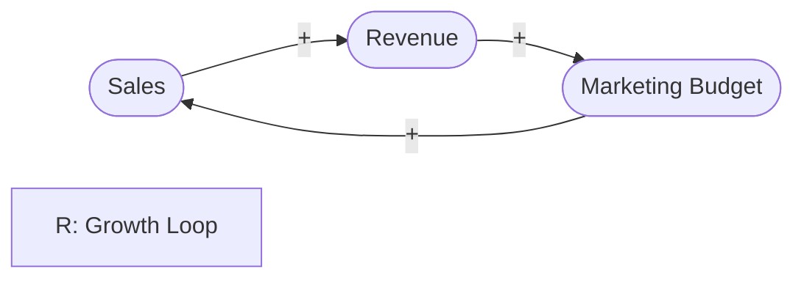
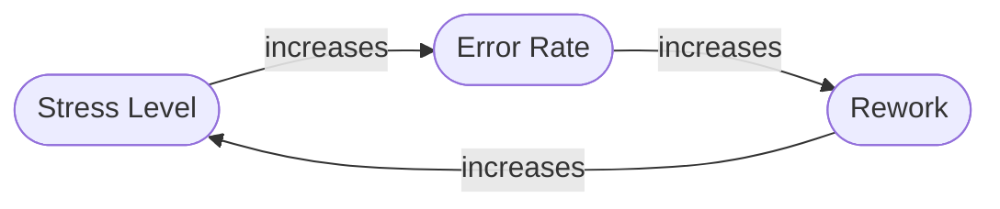
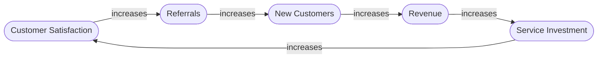

# Causal Loop Diagram Creation

Guide users through creating Causal Loop Diagrams to visualize system feedback and dynamics.

## When to Use

Trigger this skill when users:
- Want to visualize feedback loops or cycles
- Describe situations where "A leads to B which leads back to A"
- Use terms like "reinforcing," "balancing," "vicious cycle," "virtuous cycle"
- Need to understand how variables influence each other over time
- Are exploring why problems persist or grow despite interventions

## Workflow

### 1. Identify Variables (3-7 is ideal)

**Ask:** "What are the key things that change over time in this situation?"

**Guide users to name variables properly:**
- Use NOUNS (things), not verbs (actions)
- Choose neutral or positive terms
  - ✅ "Team Morale" not ❌ "Bad Feelings"
  - ✅ "Trust" not ❌ "Distrust"
  - ✅ "Sales" not ❌ "Declining Sales"
- Names should work with "level of," "amount of," or "size of"
- Avoid direction indicators ("increasing," "high," "low")

**Test question:** "Can this thing go both up AND down?"
- If no → rephrase as something that can vary

### 2. Map Relationships
For each pair of related variables, ask:
**"If [Variable A] INCREASES, what happens to [Variable B]?"**

**Two possible answers:**
- **SAME direction (+):** "B also increases" OR "If A decreases, B decreases"
- **OPPOSITE direction (-):** "B decreases" OR "If A decreases, B increases"

**Test by walking through:**
- "So if we have MORE [A], we get MORE/LESS [B]?"
- "And if we have LESS [A], we get LESS/MORE [B]?"

### 3. Identify Feedback Loops
**Look for paths that circle back to where they started.**

**Ask:** "Can you trace a path from [Variable X] that eventually leads back to [Variable X]?"

**Determine loop type:**

**Quick test:** Start at any variable, assume it INCREASES, follow arrows around:
- Back to start, the variable would increase MORE → **Reinforcing (R)**
- Back to start, the variable would decrease → **Balancing (B)**

**Or count minus signs in the loop:**
- Even number (including 0) → **Reinforcing (R)**
- Odd number → **Balancing (B)**

**Characteristics:**
- **Reinforcing (R):** Snowball effect, exponential growth/decline, "more leads to more"
  - Example: Sales → Revenue → Marketing Budget → Sales
- **Balancing (B):** Seeks equilibrium, counteracts change, self-regulating
  - Example: Hunger → Eating → Hunger (decreases)

### 4. Create the Diagram

Once variables and relationships are identified, create a Mermaid diagram.

**Mermaid Syntax Rules:**

**Format:**
- Nodes: `([Variable Name])` - stadium-shaped boxes
- Edges: `-->|+|` for same direction, `-->|-|` for opposite direction
- Keep variable names concise but clear
- For loops with 3+ variables, arrange in a circular/oval layout when possible

**Loop labels (optional):** Add text annotations for identified loops:

### 5. Tell the Story

**Prompt user:** "Walk through the diagram and tell the story - what happens when [key variable] increases?"

**Encourage narrative:**
- "When [A] increases, [B] increases, which causes [C] to decrease..."
- Verify the logic makes sense
- Identify which loops are most influential

## Conversational Approach

**Start simple:**
- Begin with 3-5 variables
- Add complexity only if needed
- One relationship at a time

**Test understanding:**
- "Does this capture what you're seeing?"
- "What would happen if we doubled [variable X]?"
- "Which loop seems most powerful in this system?"

**Iterate:**
- User discovers new connections → add them
- Relationships unclear → probe deeper
- Diagram too complex → ask what's most critical

## Common Pitfalls to Avoid

**Help users avoid:**
1. **Using time as a variable** - Things change because of other things, not time itself
2. **Confusing correlation with causation** - Just because two things move together doesn't mean one causes the other
3. **Including everything** - Focus on what's most important to the issue
4. **Directional names** - "Increasing costs" should be "Costs"
5. **Negative terms** - "Lack of motivation" should be "Motivation"

## Example Dialogue Pattern

**Claude:** "Let's map out the feedback loop you're describing. What are the main things that change over time in this situation?"

**User:** "Well, when people are stressed they make more mistakes."

**Claude:** "Good start. Let's name those as variables. Instead of 'stressed,' what if we called it 'Stress Level' - something that can go up or down? And for mistakes, maybe 'Error Rate'?"

**User:** "That works."

**Claude:** "So if Stress Level increases, what happens to Error Rate?"

**User:** "It goes up too."

**Claude:** "Perfect - that's a SAME direction (+) relationship. Now, what happens when Error Rate increases? Does that affect anything else?"

**User:** "Yeah, more errors means more rework, which creates more stress!"

**Claude:** "Interesting! So Error Rate increases Stress Level. That's also a (+) relationship. You've just identified a reinforcing loop - stress creates errors, errors create more stress. Let me draw that..."

**Claude:** "This is a reinforcing loop (R) - it amplifies itself. What might break this cycle?"

## Integration with Parent Skill
When used as part of systems-thinking:
- CLDs visualize the feedback loops identified through "Questions of a Systems Thinker"
- Use after establishing temporal orientation (CLDs work for both forward and backward analysis)
- Natural follow-up when users identify interconnected variables
- Creates artifact users can share with their teams

## Output Format

Always provide:
1. The Mermaid diagram code block
2. A brief narrative explanation of key loops
3. Labels for Reinforcing (R) and Balancing (B) loops
4. One probing question about implications or interventions

**Example output:**

**Key loops:**
- **R1 (Growth Loop):** Customer Satisfaction → Referrals → New Customers → Revenue → Service Investment → Customer Satisfaction
  - This is a reinforcing loop that can drive exponential growth when satisfaction is high

**Question:** "What might prevent this growth loop from continuing indefinitely? Where are the natural limits?"

## References

Core principles drawn from:
- The Systems Thinker guidelines on CLD construction
- System dynamics naming conventions
- Visual clarity in systems mapping

---

**Note for skill maintenance:** This skill can be extended with:
- Stock-and-flow diagram capabilities
- Delay notation (||) for time lags
- Multiple linked loops for complex systems
- Systems archetypes (Limits to Growth, Shifting the Burden, etc.)